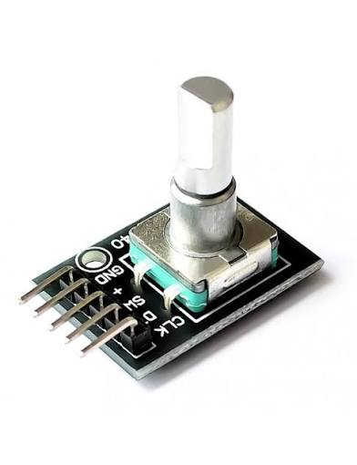
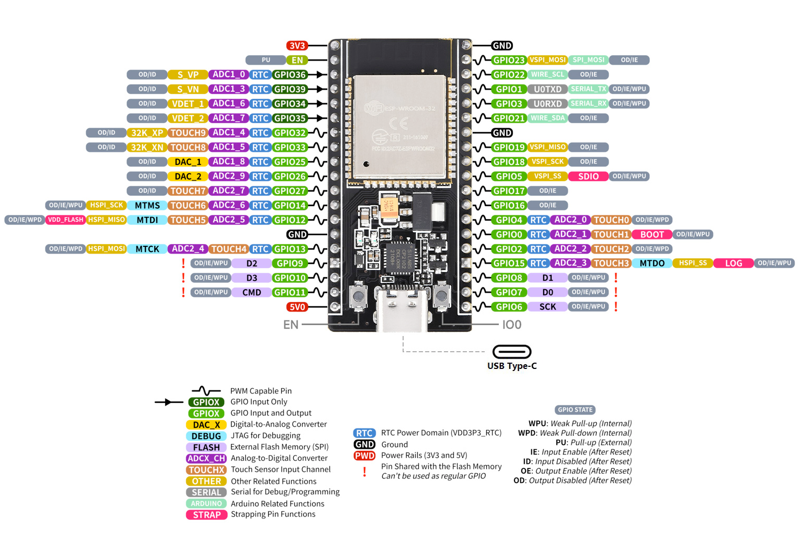
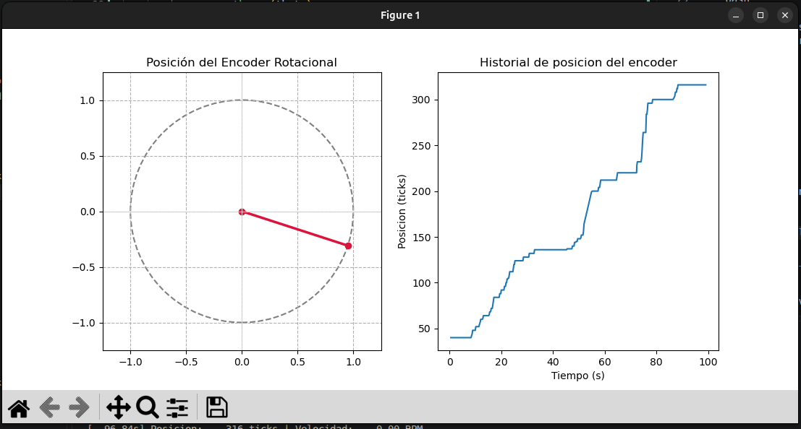

# Encoder Rotativo KY-040 con micro-ROS (ESP32)

TP Integrador — FULGOR ROS2-IA

Firmware para ESP32 que lee un encoder incremental de cuadratura (KY-040) usando
el periférico **PCNT** en modo 4x, y publica la posición (ticks) y la velocidad
(RPM) calculadas como tópicos de **ROS2**, vía **micro-ROS**.

## Objetivos

- Configurar el módulo PCNT del ESP32 para leer las señales de un encoder de cuadratura en modo 4x.
- Implementar un nodo en el ESP32 usando micro-ROS que publique posición (ticks) y velocidad (RPM).
- Visualizar y validar los datos del encoder: posición actual, curva con historial, y archivo histórico con timestamp.

## Hardware

- ESP32 DevKit (30 pines).
- Encoder incremental KY-040 (CLK, DT, SW, +, GND).
- Red WiFi compartida entre el ESP32 y la PC que corre el Agent.

### Conexión

| KY-040 | ESP32  |
| ------ | ------ |
| CLK    | GPIO32 |
| DT     | GPIO33 |
| GND    | GND    |
| +      | 3V3    |



*Fig 1. KY-040*



*Fig 2. ESP32*

## Estructura del proyecto

```
rotary_encoder/
├── main/
│   ├── encoder_microros_main.c   # firmware: PCNT + nodo micro-ROS
│   └── CMakeLists.txt
├── components/
│   └── micro_ros_espidf_component/   # componente micro-ROS 
├── pc_tools/
│   └── encoder_monitor.py        # monitor de PC: posición, curva y log CSV
└── docs/img/                     # capturas y fotos del armado
```

## Tópicos publicados

| Tópico            | Tipo                 | Descripción                                |
| ------------------ | -------------------- | ------------------------------------------- |
| `/encoder_ticks` | `std_msgs/Int32`   | Posición absoluta acumulada, en ticks (4x) |
| `/encoder_rpm`   | `std_msgs/Float32` | Velocidad angular, en RPM                   |

## Cómo compilar y flashear

```bash
# solo la primera vez si no esta instalado el componente de microros
mkdir components
cd components
git clone -b jazzy https://github.com/micro-ROS/micro_ros_espidf_component.git
```

```bash
cd rotary_encoder
. $IDF_PATH/export.sh
idf.py menuconfig   # micro-ROS Settings: Agent IP/Port, WiFi SSID/Password
idf.py build
idf.py flash monitor
```

## Cómo levantar el micro-ROS Agent

En otra terminal (esta sí con ROS2 sourceado):

```bash
cd ~/micro_ws
source install/setup.bash
ros2 run micro_ros_agent micro_ros_agent udp4 --port 8888
```

Verificación:

```bash
ros2 topic list
ros2 topic echo /encoder_ticks
ros2 topic echo /encoder_rpm
```

## Visualización y log de datos

```bash
#en una terminal con ros2 sourceado
cd pc_tools
python3 encoder_monitor.py
```


